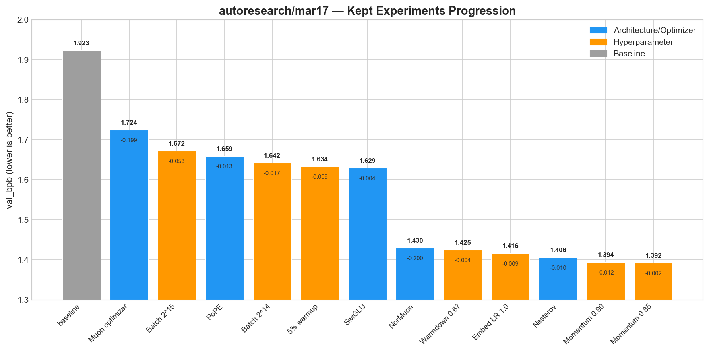
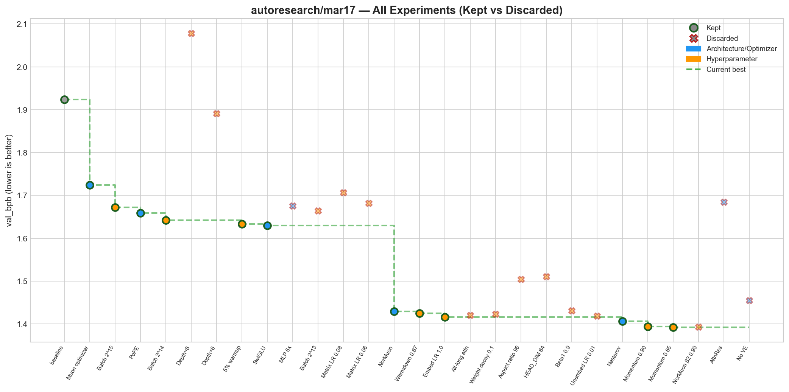
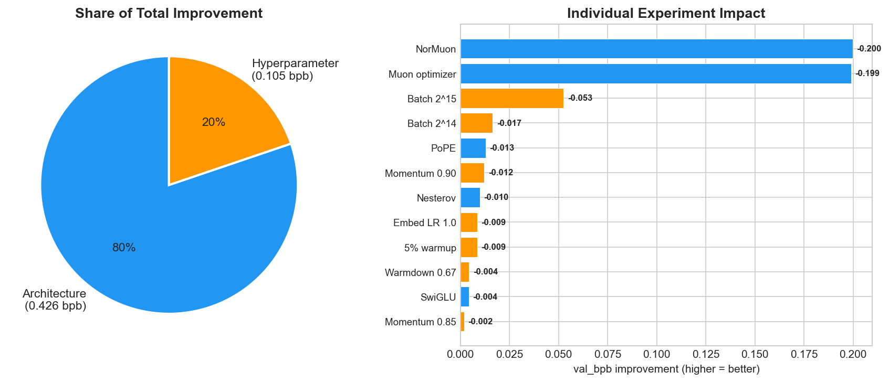
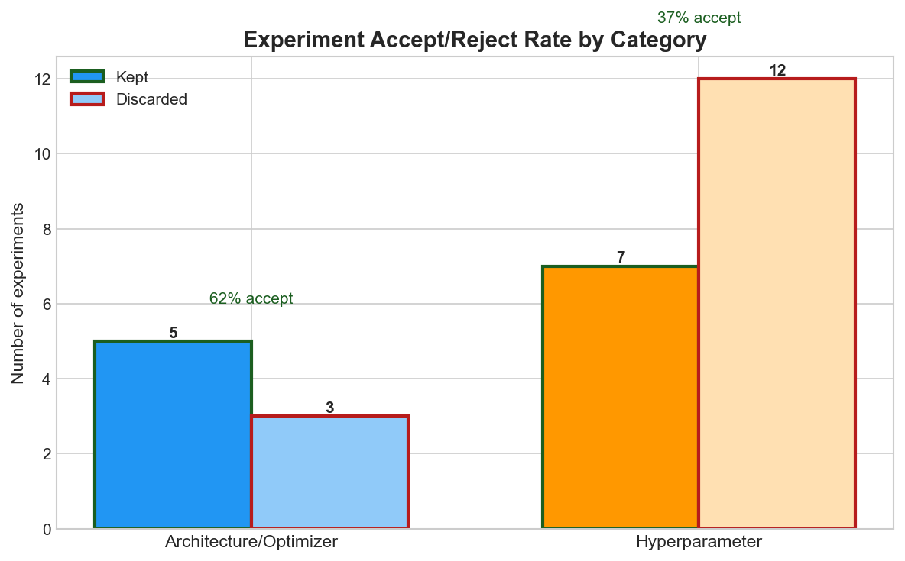

# autoresearch-mlx

Apple Silicon (MLX) port of [Karpathy's autoresearch](https://github.com/karpathy/autoresearch).

Full credit to [@karpathy](https://github.com/karpathy) for the core idea: fixed-time autonomous research loops controlled through `program.md`. This port keeps the same basic rules: one mutable `train.py`, one metric (`val_bpb`), a fixed 5-minute training budget, and keep-or-revert via git. It runs natively on Apple Silicon through [MLX](https://github.com/ml-explore/mlx), so there is no PyTorch or CUDA dependency.

## Quick start

Requirements: Apple Silicon Mac, Python 3.10+, [uv](https://docs.astral.sh/uv/).

```bash
# install uv if needed
curl -LsSf https://astral.sh/uv/install.sh | sh

# install dependencies
uv sync

# one-time data + tokenizer prep
uv run prepare.py

# run one 5-minute training experiment
uv run train.py
```

Then point Claude Code or another coding agent at `program.md` and let it run the loop.

## What matters

- `prepare.py` - data prep, tokenizer, dataloader, and evaluation. Treat as fixed.
- `train.py` - model, optimizer, and training loop. This is the file the agent edits.
- `program.md` - the autonomous experiment protocol.
- `results.tsv` - logged experiment history.

The loop is the same as upstream: edit `train.py`, run a fixed-budget experiment, read `val_bpb`, keep the change if it wins, revert if it loses, and repeat.

## Public baseline results

The public `results.tsv` captures the initial hardware-local walk from the default baseline down to `1.807902`:

| Commit | val_bpb | Status | Description |
|---|---:|---|---|
| `383abb4` | 2.667000 | keep | baseline (AdamW, default config) |
| `909dd59` | 2.588904 | keep | halve total batch size to `2^16` |
| `4161af3` | 2.533728 | keep | increase matrix LR to `0.04` |
| `5efc7aa` | 1.807902 | keep | reduce depth from `8` to `4` |

That result already shows the core Apple Silicon pattern: with a fixed 5-minute wall clock, smaller faster-training models can beat larger ones simply by fitting more optimizer steps into the budget.

## mar17 run — M4 Pro 24 GB (1.923 → 1.392)

A fully autonomous run on an M4 Pro MacBook Pro (24 GB unified memory). The agent ran 27 total experiments over ~3 hours, keeping 13 and discarding 14. The run used web search to discover and implement 2026 optimizer advances (Muon, NorMuon, PoPE) that were beyond the LLM's training cutoff.

### Progression of kept experiments



| # | Commit | val_bpb | Change | Category | Description |
|---|--------|--------:|-------:|----------|-------------|
| 0 | `eec0b91` | 1.923 | — | baseline | AdamW, RoPE, squared ReLU, depth=4 |
| 1 | `be83fff` | 1.724 | **-0.199** | architecture | Muon optimizer (Newton-Schulz orthogonalization) |
| 2 | `bc81e67` | 1.672 | -0.053 | hyperparameter | Halve total batch size to 2^15 |
| 3 | `86a3e94` | 1.659 | -0.013 | architecture | PoPE (Polar Positional Embedding) replacing RoPE |
| 4 | `b519033` | 1.642 | -0.017 | hyperparameter | Reduce total batch size to 2^14 |
| 5 | `fc4ecc8` | 1.634 | -0.009 | hyperparameter | Add 5% warmup ratio |
| 6 | `30cc6e7` | 1.629 | -0.004 | architecture | SwiGLU activation replacing squared ReLU |
| 7 | `9bf2cf7` | 1.430 | **-0.200** | architecture | NorMuon (neuron-wise normalized Muon) |
| 8 | `31b5ff6` | 1.425 | -0.004 | hyperparameter | Increase warmdown ratio to 0.67 |
| 9 | `5120403` | 1.416 | -0.009 | hyperparameter | Increase embedding LR to 1.0 |
| 10 | `02febce` | 1.406 | -0.010 | architecture | Nesterov momentum for Muon |
| 11 | `4bce0c1` | 1.394 | -0.012 | hyperparameter | Reduce Muon momentum to 0.90 |
| 12 | `412a837` | 1.392 | -0.002 | hyperparameter | Reduce Muon momentum to 0.85 |

### All experiments — kept vs discarded



Discarded experiments include: depth=8 (too slow), depth=6, batch 2^13 (too small), MLP 6x, matrix LR 0.08/0.06, AttnRes (Attention Residuals), weight decay 0.1, aspect ratio 96, HEAD_DIM 64, beta1 0.9, unembedding LR 0.01, NorMuon beta2 0.99, all-long attention, and removing value embeddings.

### Architecture vs hyperparameter impact



**80% of the total improvement came from architecture/optimizer changes**, not hyperparameter tuning. The two largest single-experiment wins were Muon (-0.199) and NorMuon (-0.200), both optimizer architecture changes discovered via web search during the run. This suggests future autoresearch runs should prioritize architecture discovery over hyperparameter sweeps.

### Accept/reject rates



Architecture experiments had a **62% accept rate** (5 of 8) vs **37% for hyperparameters** (7 of 19). Architecture changes were both higher-impact and more likely to succeed.

### Key techniques discovered

- **Muon + NorMuon**: Newton-Schulz orthogonalization with neuron-wise normalization for hidden-layer weights. Combined with Nesterov momentum. Used AdamW for embeddings/scalars.
- **PoPE**: Polar Coordinate Positional Embedding — decouples content and position in attention via softplus magnitudes and position-dependent cos/sin phases.
- **SwiGLU**: Gated linear unit with SiLU activation in the MLP, replacing squared ReLU.

## Longer Apple Silicon runs

Longer overnight runs on the working MLX port pushed much further. The long Mac Mini test is included here because it found a meaningfully different winner stack from the Max-class machines.

| Machine | Current best | Starting point | Repeated wins |
|---|---:|---:|---|
| M4 Pro 24GB | 1.392171 | 1.923455 | NorMuon + Nesterov, PoPE, SwiGLU, lean batch, long warmdown |
| M4 Max #1 | 1.294526 | 1.596971 | AdamW-only, low matrix LR, 3x MLP, no logit cap, moderate weight decay |
| M4 Max #2 | 1.330509 | 1.807902 | leaner batch, long anneal, SiLU, lower regularization, no logit cap |
| Mac Mini (long run) | 1.353329 | 1.922472 | Muon, sharper attention, smaller MLP, lower scalar LR |

The M4 Pro result is notable for achieving a competitive val_bpb (1.392) on a 24 GB machine using only 5.6 GB of memory, leaving substantial headroom. The strongest changes came from optimizer architecture (Muon/NorMuon), not hyperparameter tuning — confirming that the biggest wins in fixed-budget training come from how you use your compute, not how much you have.

## Differences from upstream

- **MLX instead of PyTorch/CUDA.** Native Apple Silicon training with unified memory.
- **AdamW-only public path.** This public `train.py` keeps the default path simple. The long Mac Mini run above explored a Muon variant in the working port, but that branch is not exposed as a public default here.
- **Smaller eval token budget.** Reduced for faster iteration on Apple Silicon while keeping the same `evaluate_bpb` interface in `prepare.py`.
- **Roughly 6-7 minutes per experiment.** Expect 5 minutes of training plus compile and eval overhead.
- **MFU reporting is placeholder.** There is no Apple Silicon equivalent to the H100 FLOPs reference used upstream.

## Acknowledgments

- [Andrej Karpathy](https://github.com/karpathy) - autoresearch and nanochat
- [scasella/nanochat-mlx](https://github.com/scasella/nanochat-mlx) - MLX GPT and optimizer reference
- [awni/picochat](https://github.com/awni/picochat) - MLX training patterns
- [Apple MLX team](https://github.com/ml-explore/mlx)

## License

MIT. See [LICENSE](LICENSE).
